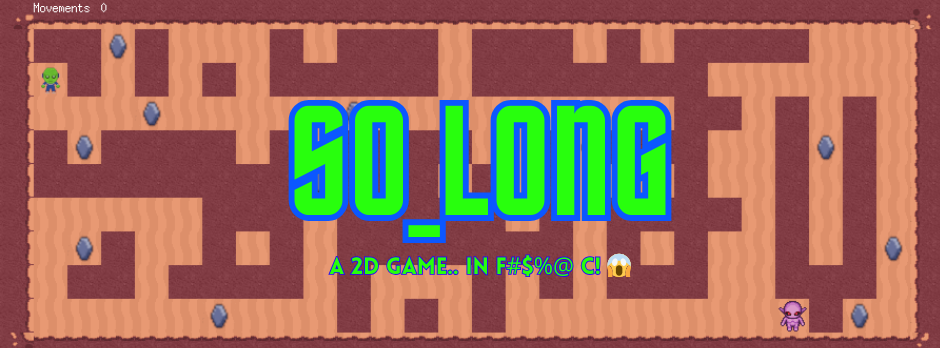
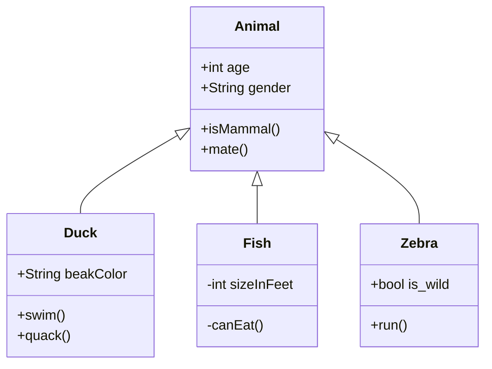

# So_long - THIS REPOSITORY IS UNDER CONSTRUCTION! PLEASE BE AWARE


"The goal of this project is to code a 2D game using the MiniLibx."

## Table of contents
- [Introduction](#introduction)
- [Usage](#usage)
- [Bonus](#bonus)
- [Makefile Overview](#makefile-overview)
- [License and Thoughtful Advice](#license-and-thoughtful-advice)

## Introduction

This project is a very small 2D game. Its purpose is to make you work with textures, sprites,
and some other very basic gameplay elements.
With this project, we embark on a foundational computer graphics project aimed at cultivating essential skills in window management, 
event handling, color representation, texture rendering, and related aspects. Leveraging the MiniLibX library, an internally developed toolset, 
this endeavor provides a structured platform for navigating tasks such as window creation, image manipulation, and user input management.

This project emphasizes rigor in C programming, application of fundamental algorithms, and research proficiency. 
It offers an opportunity to engage methodically with graphical programming concepts, fostering incremental skill development and reinforcing core principles in software engineering.
>The code was written according to the 42 norm guidelines(norminette).

## Usage
**Important!** <br>
Please note that due to potential incompatibilities with the MiniLibX library, this project may encounter issues when executed on certain systems. 
It has been specifically developed and tested on Linux Ubuntu 22.04, and its functionality on other platforms may vary.
1. Clone the repository
```bash
git clone git@github.com:amauricoder/42_So_Long.git
```
2. In your terminal, do make to compile the files:
```bash
make
```
This will download the external library and generate a so_long file in the root folder, this is the executable for the game.

3. To start playing, go to your terminal and use the executable with a path to a valid map as argument:
``` bash
./so_long maps/lady.ber
```
4. This will open the window of the main game. Use the keys A,S,D,W or Arrows to move your character. The goal is to take all coins and go to the UFO.

## BONUS
The Bonus section of this project was developed in compliance with the subject requirements, 
which stipulated the inclusion of animations, text strings on the screen, and the introduction of an enemy character.
This is a more "open" project, so I've decided to to a little "multiplayer" experience with my project.
### Bonus Usage
1. Clone the repository
```bash
git clone git@github.com:amauricoder/42_So_Long.git
```
2. In your terminal, do make bonus to compile the files:
```bash
make bonus
```
This will download the external library and generate a so_long_bonus file in the root folder, this is the executable for the game.

3. To start playing, go to your terminal and use the executable with a path to a valid map as argument:
``` bash
./so_long maps/lady.ber
```
4. This will open the window of the bonus game. Use the keys A,S,D,W to control the PLAYER1 and the UP, DOWN, LEFT, RIGHT arrows to control the PLAYER2.
   In this game, PLAYER1's objective is to collect all the coins and successfully escape the game area. Meanwhile, PLAYER2's goal is to intercept PLAYER1 and prevent their escape.
   If PLAYER2 manages to make contact with PLAYER1, the game concludes, and PLAYER1 loses. Conversely, if PLAYER1 successfully collects all the coins and manages to escape, PLAYER2 loses the game.

## Makefile Overview

In this project, the Makefile offers the following essential rules:
- **make**: Download the MiniLibX to the `library/` folder, compile the MiniLibX, compile the Libft and compile the project executable to `so_long` .
- **make bonus**: Download the MiniLibX to the `library/` folder, compile the MiniLibX, compile the Libft and compile the project bonus executable to `so_long_bonus` .
- **make clean**: Cleans the `.o` files, preserving `so_long`.
- **make fclean**: Completely cleans the directory by deleting all `.o` files and the executable `so_long`.
- **make re**: Refreshes the executable `so_long` by recompiling everything.

<!--

-->

